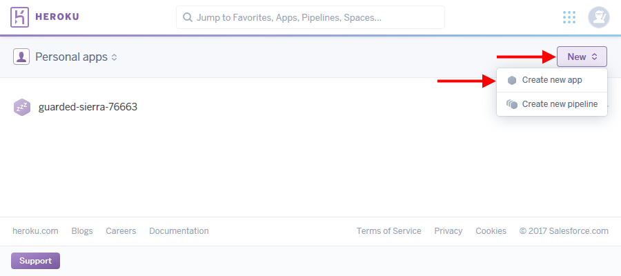
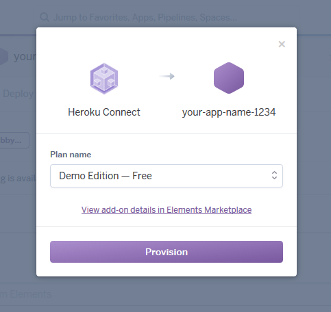
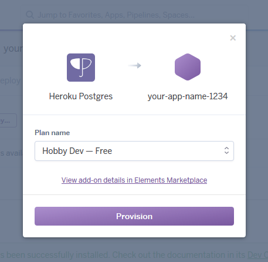
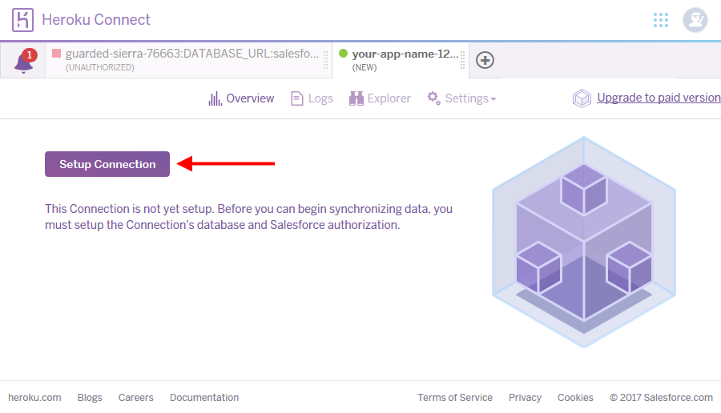
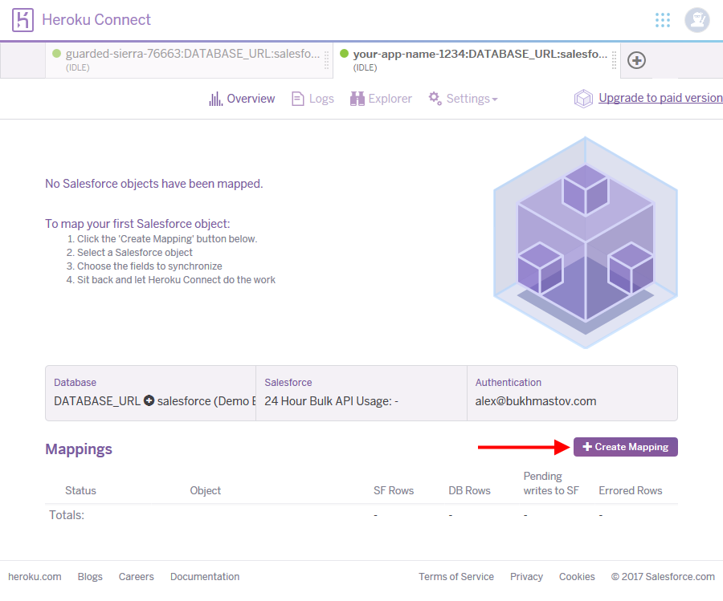
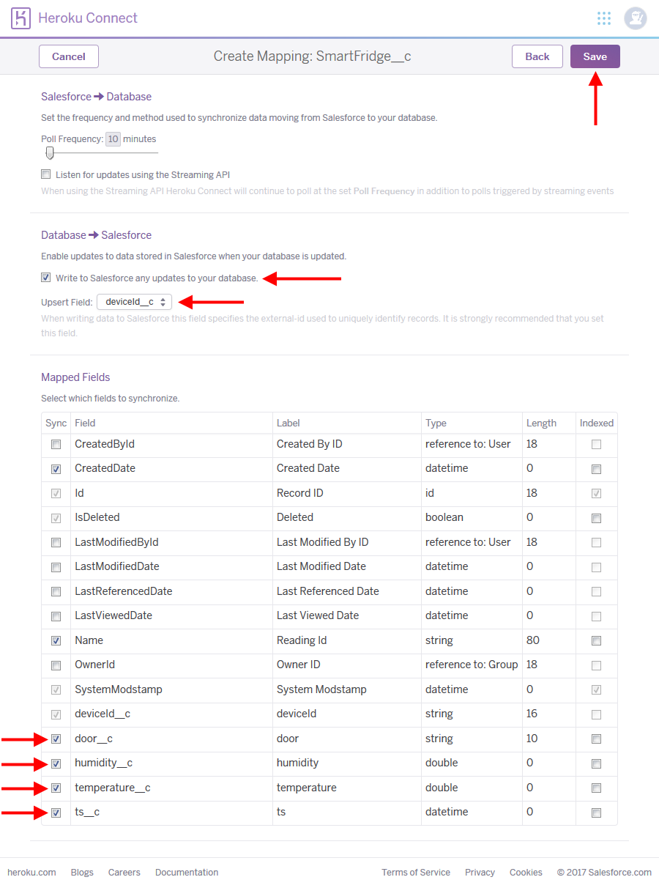
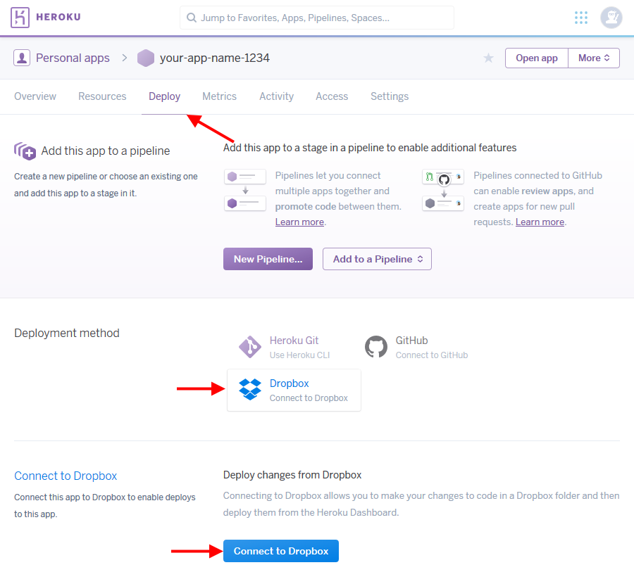
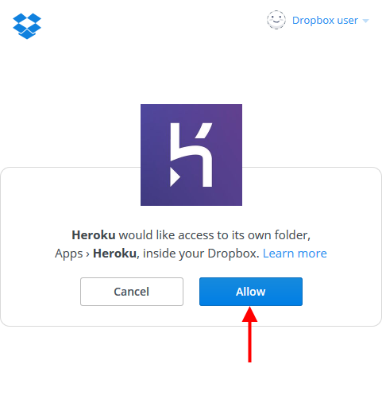
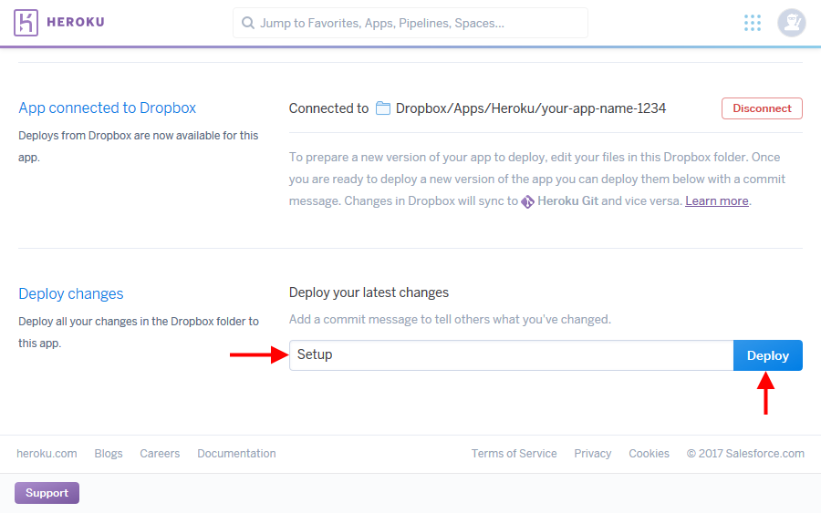

# SalesforceHeroku
Sample of the Salesforce/Heroku integration

### Step 1: Create a Heroku App

Step by step instructions to create a Heroku App:

1. Log into Heroku and click on the **New** button, then click on the **Create new app** button

2. Enter **app name** and **runtime selection**, then click **Create App** button

3. Go to **Resourses** tab on the top of the page to install add-ons

	- Install Heroku Connect add-on
		- Type **heroku connect** in the add-ons search input and select **Heroku Connect** from the dropdown list
		
		- Choose plan and click **Provision** button
		
	- Install Heroku Postgres add-on
		- Type **heroku postgres** in the add-ons search input and select **Heroku Postgres** from the dropdown list
		
		- Choose plan and click **Provision** button
		
	- Heroku Connect setup
		- Click **Heroku Connect** in the Add-ons list
		
		- Setup connection
			- Click **Setup connection**
			
			- Click **Next**
			- Click **Authorize**
			- Authorize in your Salesforce account and click **Allow** to allow Heroku Connect access to your Salesforce account
		- Create Mapping
			- Click **+ Create Mapping**
			
			- Choose **SmartFridge__c** object
				1. Select **Write to Salesforce any updates to your database** checkbox
				2. Choose **deviceId__c** upsert Field
				3. Select **door__c**, **humidity__c**, **temperature__c**, **ts__c** fields
				
			- Click **Save** button
			- Click **+ Create Mapping**
			- Choose **Case** object
				1. Select **Write to Salesforce any updates to your database** checkbox
				2. Select **Description**, **Subject**, **Related_Fridge__c**, **Related_Fridge__r__deviceId__c** fields
			- Click **Save** button			
4. Go to **Deploy** tab on the top of the page to deploy heroku code

	- Select **Dropbox** tile in the **Deployment method** section
	- Click **Connect to Dropbox** button in the **Connect to Dropbox** section
		- In the popup window click **Allow** button to give Heroku access to your Dropbox**
		
	- Upload Heroku code files to your Dropbox account (Dropbox/Apps/Heroku/<your-app-name>)
	- Enter commit message and click **Deploy** button in the **Deploy changes** section
	

## License

The Salesforce library is licensed under the [MIT License](./LICENSE).
